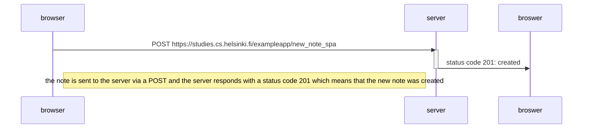

```mermaid
sequenceDiagram
  participant browser
  participant server

  browser->>server: POST https://studies.cs.helsinki.fi/exampleapp/new_note_spa
  activate server
  server->>broswer: status code 201: created
  deactivate server

  Note right of browser: the note is sent to the server via a POST and the server responds with a status code 201 which means that the new note was created
```